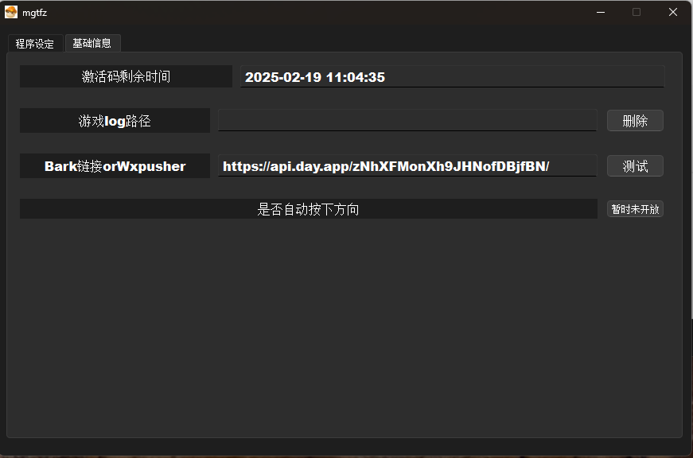

# beafun_AI_direction

准确率高达99%的方向识别器


- 需要的联系qq:3218915168

# 测谎报警器（电脑声音提醒）


- 支持点击5下报警测谎报警
- 支持验证码测谎报警
- 支持菲欧娜测谎报警
- 支持死亡报警
- 支持鼠标滑动测谎（挖矿测谎）
- 支持出现boss报警
- 支持旋转箭头报警
- 支持红点报警
- 支持手机通知
- 支持log删除

# 使用说明
置信度:代表目前识别到的概率。如果设置测谎置信度为10%。当识别模型识别到游戏画面出现测谎的概率为80%时。就会进行测谎提醒。当低于10%不会提醒。

按照经验，可参考如下参数：
1. 如果第一次使用建议设置
```
测谎 ： 50
验证码框：40
菲欧娜测谎报警 ：40
挖矿测谎报警 ：40
死亡报警 ：60
boss报警 ：60
旋转箭头报警：60
红点报警 ：60

```

2. 经过后期至少2轮学习后
```
测谎 ： 75
验证码框：60
菲欧娜测谎报警 ：60
挖矿测谎报警 ：60
死亡报警 ：80
boss报警 ：80
旋转箭头报警：80
红点报警 ：80

```
3. 如果某个图出现误识别比较多。如红点检测，可直接设置99%。可让其不做提醒
4. 如果电脑相对较差，可降低识别速度，设置为2s每秒


# 推送说明
- 苹果手机尽量用bark（app商场中下载）,把里面的推送连接放在上面包含最后的/，可参考上面的图片
- 安卓用户用微信的wxpusher。https://wxpusher.zjiecode.com/wxuser/?type=1&id=41635#/follow,在微信中点击该url。
关注公众号后，获取自己uid放上就行。如果不行，重新点击上面链接。通常获取了url之后需要再点我上面链接才行。第一次点击是关注
公众号，第二次才是进入我的推送频道
